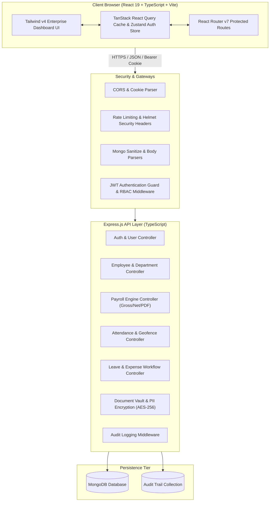
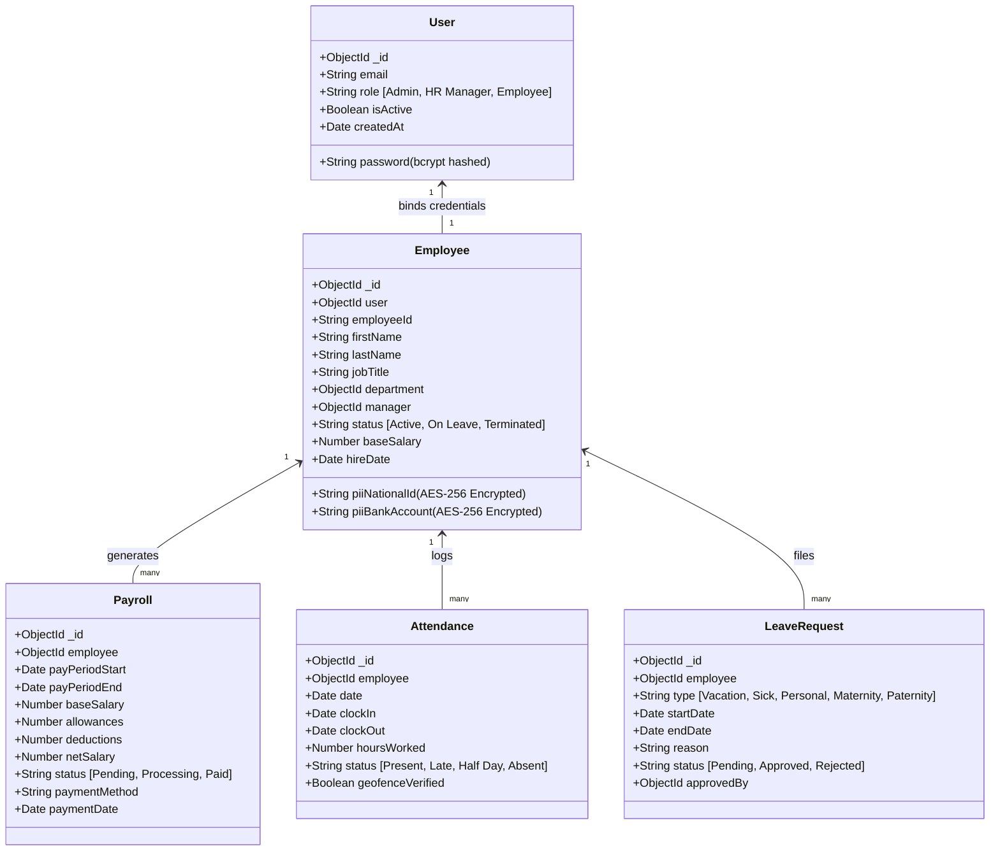

# 🏢 Enterprise HRMS & Automated Payroll Management Dashboard

[](https://reactjs.org/)
[](https://www.typescriptlang.org/)
[](https://vitejs.dev/)
[](https://tailwindcss.com/)
[](https://nodejs.org/)
[](https://expressjs.com/)
[](https://www.mongodb.com/)
[](https://nodejs.org/api/crypto.html)

A high-performance, full-stack **Enterprise Human Resource Management System (HRMS)** and **Automated Payroll Engine**. Engineered for modern workforce operations, compliance-ready payroll distribution, real-time geofenced attendance tracking, multi-tier approval workflows, and personalized Employee Self-Service (ESS) portals.

---

## 📑 Table of Contents

- [System Architecture](#-system-architecture)
- [Core Features & Modules](#-core-features--modules)
  - [1. HR & Executive Command Center](#1-hr--executive-command-center)
  - [2. Employee Self-Service (ESS) Portal](#2-employee-self-service-ess-portal)
  - [3. Automated Payroll Engine & Compensation Breakdown](#3-automated-payroll-engine--compensation-breakdown)
  - [4. Biometric & Geofenced Attendance](#4-biometric--geofenced-attendance)
  - [5. Approvals Hub (Leaves & Claims)](#5-approvals-hub-leaves--claims)
  - [6. Shift Management & Performance Appraisals](#6-shift-management--performance-appraisals)
  - [7. Enterprise Document Vault & Encrypted Records](#7-enterprise-document-vault--encrypted-records)
  - [8. Bulletins, Grievances, & Offboarding Workflows](#8-bulletins-grievances--offboarding-workflows)
- [Technology Stack](#-technology-stack)
- [Repository Structure](#-repository-structure)
- [Database Schema & PII Protection](#-database-schema--pii-protection)
- [REST API Specifications](#-rest-api-specifications)
- [Environment Variables](#-environment-variables)
- [Local Setup & Installation](#-local-setup--installation)
- [Default Demo Credentials](#-default-demo-credentials)
- [Production Build & Deployment](#-production-build--deployment)
- [Security & Compliance Standards](#-security--compliance-standards)

---

## 🏛 System Architecture

The application adopts a decoupled client-server micro-architecture: a **React 19 + Tailwind v4 Single Page Application (SPA)** that communicates over secured REST endpoints with a **Node.js / Express TypeScript backend** backed by **MongoDB**.



---

## 🚀 Core Features & Modules

### 1. HR & Executive Command Center
- **Executive Metric Cards**: Headcount, Present Today, On Leave, and Total Payroll disbursements with trend badges and clickable directory transitions.
- **Interactive SVG Analytics**: 
  - **Attendance Trend Area Chart**: Visualizes 7-day attendance volume vs. historical baselines.
  - **Staff Donut Distribution**: Interactive breakdown of headcount across departments.
  - **Financial Cost Bar Chart**: Comparison between total net payroll and department averages.
  - **Expense Category Chart**: Approved reimbursements categorized by Travel, Equipment, Wellness, and Software.
- **Live System Activity Feed**: Real-time event auditing for newly onboarded staff, leave decisions, and payroll disbursements.
- **Broadcast Notices**: Global administrative bulletin poster supporting priority levels (`Low`, `Medium`, `High`).

### 2. Employee Self-Service (ESS) Portal
- **Personalized Workspace**: Tailored landing view displaying employee designations, reports-to hierarchy, and personalized action hubs.
- **Attendance Rate Gauge**: Circular SVG progress gauge showing monthly attendance rate, present day counts, and shift streak meters.
- **Leave Allocation Meter**: Dynamic progress bar tracking PTO, Medical, and Casual leave allowances.
- **Compensation Structure View**: Interactive visual breakdown of Base Salary, Allowances, Deductions, and Net Take-Home pay.
- **One-Click Requests**: Apply for time off and request expense reimbursements directly from the workspace.

### 3. Automated Payroll Engine & Compensation Breakdown
- **Gross-to-Net Calculator**: Automated computation of Base Salary + Variable Allowances - Statutory Taxes/Deductions.
- **Ledger Overview**: Filterable by payment status (`Paid`, `Pending`, `Processing`), payment method (ACH, Bank Transfer, Wire), and department.
- **Batch Processing**: Run payroll disbursements for entire departments or specific pay periods.
- **PDF Payslip Generation**: Server-side cryptographically sealed payslips rendered with `pdfkit` containing company header, breakdown tables, and SHA-256 digital seals.

### 4. Biometric & Geofenced Attendance
- **Geofence Clock In/Out**: Real-time geolocation and IP verification simulation confirming employee presence within authorized corporate office coordinates.
- **Live Shift Tracking**: Auto-calculates daily shift completion, logged hours, and overtime accumulation.
- **Historical Attendance Matrix**: Monthly attendance logs with timestamps and status indicators (`Present`, `Late`, `Half Day`, `Absent`).

### 5. Approvals Hub (Leaves & Claims)
- **Pending Approvals Hub**: Tabbed management interface for pending Leave Requests and Expense Reimbursements.
- **One-Click Approval Actions**: Instant approve/reject controls backed by optimistic UI updates via TanStack Query.
- **Receipt & Supporting Evidence Viewer**: Review itemized expense descriptions, categories, and amounts before issuing reimbursement approval.

### 6. Shift Management & Performance Appraisals
- **Workforce Scheduler**: Assign Day, Evening, and Night shifts to team members across departments.
- **Appraisal Reviews**: Multi-criteria performance evaluations (Productivity, Leadership, Communication, Code Quality) with rating scores and formal review notes.

### 7. Enterprise Document Vault & Encrypted Records
- **Document Management**: Central repository for Employment Contracts, NDAs, Identity Proofs, and Tax Declarations.
- **PII Protection**: Sensitive employee fields (SSN, National ID, Bank Account Numbers, Emergency Contact PII) are encrypted at rest using **AES-256-CBC**.

### 8. Bulletins, Grievances, & Offboarding Workflows
- **Company Bulletins**: Organization-wide communication board with priority filters.
- **Confidential Grievance Redressal**: Whistleblower and workplace grievance submission system with restricted administrative review.
- **Offboarding & Exit Workflow**: Structured employee resignation processing, clearance checklist tracking, and asset handover verification.

### 9. Dynamic Visual Theme Engine (Dark / Light / System Mode)
- **Zero-Flicker Persistence**: Global `ThemeProvider` with local storage persistence and automatic OS synchronization (`prefers-color-scheme`).
- **High-Contrast Enterprise Palettes**:
  - **Dark Mode (Default)**: Deep obsidian (`#090a0f`) and card surfaces (`#11131a`) with electric indigo accents.
  - **Light Mode**: Crisp alabaster (`#f4f6fb`) and pure white cards (`#ffffff`) with structured slate borders (`#e2e8f0`).
- **Seamless Quick Controls**: One-click dropdown switcher in the main navigation header and interactive visual preview cards in the System Settings panel.

---

## 🛠 Technology Stack

### Frontend Architecture
| Layer | Technologies |
| :--- | :--- |
| **Framework & Core** | [React 19](https://react.dev/), [TypeScript 5.5+](https://www.typescriptlang.org/), [Vite 8](https://vitejs.dev/) |
| **Styling & Design System** | [Tailwind CSS v4](https://tailwindcss.com/) with native CSS `@theme` tokens and `@utility` helpers |
| **State & Data Fetching** | [TanStack React Query v5](https://tanstack.com/query/latest) (caching, optimistic mutations, window focus control) |
| **Routing & Auth Guards** | [React Router v7](https://reactrouter.com/), Context API (`AuthProvider`), Protected Route wrappers |
| **Icons & Visuals** | [Lucide React](https://lucide.dev/) |
| **HTTP Client** | [Axios](https://axios-http.com/) configured with interceptors, JWT authorization headers, and cookie forwarding |

### Backend Architecture
| Layer | Technologies |
| :--- | :--- |
| **Runtime & Server** | [Node.js 18+](https://nodejs.org/), [Express.js 4.21](https://expressjs.com/), [TypeScript](https://www.typescriptlang.org/) |
| **Database & ODM** | [MongoDB](https://www.mongodb.com/), [Mongoose 8.6](https://mongoosejs.com/) |
| **Authentication & Security** | [JSON Web Tokens (JWT)](https://jwt.io/), [bcryptjs](https://github.com/dcodeIO/bcrypt.js), [Helmet](https://helmetjs.github.io/), [express-rate-limit](https://github.com/express-rate-limit/express-rate-limit), [express-mongo-sanitize](https://github.com/fiznool/express-mongo-sanitize) |
| **Cryptography** | Node.js `crypto` with `AES-256-CBC` encryption and Initialization Vector (IV) padding |
| **Document Generation** | [PDFKit 0.20](https://pdfkit.org/) for programmatic server-rendered payslips |
| **Validation** | [Zod 3.23](https://zod.dev/) for payload validation schemas |

---

## 📂 Repository Structure

```
.
├── backend/
│   ├── src/
│   │   ├── config/             # Database connection & cryptographic key initialization
│   │   ├── controllers/        # Business logic (Auth, Employees, Payroll, Leaves, etc.)
│   │   ├── middleware/         # Auth verification, RBAC guard, Audit logger, Error handler
│   │   ├── models/             # Mongoose schemas (User, Employee, Payroll, Attendance, etc.)
│   │   ├── routes/             # Express API routing definitions
│   │   ├── utils/              # AES-256 cipher helpers, PDF generator, Token signers
│   │   ├── seeder.ts           # Database initialization and demo records seeder
│   │   └── server.ts           # Express server bootstrap & middleware registry
│   ├── .env.example            # Backend environmental configuration template
│   ├── package.json            # Node.js backend dependencies & lifecycle scripts
│   └── tsconfig.json           # Backend TypeScript configuration
│
├── frontend/
│   ├── src/
│   │   ├── assets/             # Branding visual assets
│   │   ├── components/         # Shared UI components (DashboardLayout, Charts, Gauges)
│   │   ├── hooks/              # Custom React hooks (useAuth, useToast)
│   │   ├── pages/              # Application views:
│   │   │   ├── Attendance.tsx  # Geofence clock-in & attendance history
│   │   │   ├── AuditLogs.tsx   # System security audit trail
│   │   │   ├── Bulletins.tsx   # Broadcast announcements
│   │   │   ├── Documents.tsx   # Encrypted digital document repository
│   │   │   ├── Employees.tsx   # Master workforce directory
│   │   │   ├── Expenses.tsx    # Reimbursement claims and receipt tracking
│   │   │   ├── Grievances.tsx  # Confidential workplace issue resolution
│   │   │   ├── Leaves.tsx      # Time-off requests and leave ledger
│   │   │   ├── Login.tsx       # Secure enterprise authentication screen
│   │   │   ├── Offboarding.tsx # Resignation and exit interview workflow
│   │   │   ├── Onboard.tsx     # 3-step employee recruitment wizard
│   │   │   ├── Overview.tsx    # Role-adaptive command dashboard
│   │   │   ├── Payroll.tsx     # Payroll execution, ledger & payslip exports
│   │   │   ├── Profile.tsx     # Profile viewer and master records manager
│   │   │   ├── Reviews.tsx     # Performance appraisal management
│   │   │   ├── Schedule.tsx    # Shift scheduling and workforce allocation
│   │   │   └── Settings.tsx    # System security, backup, and notifications
│   │   ├── utils/              # Axios instance configuration and date formatters
│   │   ├── App.tsx             # Root routing layout, query client, and role guards
│   │   ├── index.css           # Tailwind CSS v4 design system tokens & utilities
│   │   └── main.tsx            # React application entry point
│   ├── .env.example            # Frontend environmental configuration template
│   ├── index.html              # HTML5 application shell
│   ├── package.json            # Frontend dependencies & Vite scripts
│   ├── tsconfig.json           # Frontend TypeScript compiler options
│   └── vite.config.ts          # Vite build, bundling, and proxy configuration
│
└── README.md                   # Complete developer documentation
```

---

## 🔒 Database Schema & PII Protection

Sensitive employee Personally Identifiable Information (PII) is encrypted before persistence using an enterprise-grade `AES-256-CBC` cipher strategy.



---

## 📡 REST API Specifications

All endpoints (with the exception of `/api/auth/login`) require a valid Bearer token passed in the `Authorization` header or HTTP-only cookies.

| Domain | Method | Endpoint | Allowed Roles | Description |
| :--- | :---: | :--- | :--- | :--- |
| **Auth** | `POST` | `/api/auth/register` | `Admin` | Register new user credentials |
| | `POST` | `/api/auth/login` | Public | Authenticate user & issue JWT |
| | `POST` | `/api/auth/logout` | Authenticated | Invalidate authentication session |
| | `GET` | `/api/auth/me` | Authenticated | Retrieve session details for active user |
| **Employees** | `GET` | `/api/employees` | `Admin`, `HR Manager` | Fetch master employee directory with filters |
| | `POST` | `/api/employees` | `Admin`, `HR Manager` | Onboard and enroll a new workforce member |
| | `GET` | `/api/employees/:id` | Authenticated | Retrieve specific employee record |
| | `PUT` | `/api/employees/:id` | `Admin`, `HR Manager` | Modify master employee record |
| | `GET` | `/api/employees/profile/me` | Authenticated | Retrieve active authenticated user's profile |
| | `PUT` | `/api/employees/profile/me` | Authenticated | Update personal contact info & bio |
| **Departments** | `GET` | `/api/departments` | Authenticated | List all active corporate departments |
| | `POST` | `/api/departments` | `Admin` | Provision a new organizational department |
| **Payroll** | `GET` | `/api/payroll` | `Admin`, `HR Manager` | Retrieve complete organization payroll ledger |
| | `POST` | `/api/payroll/run` | `Admin`, `HR Manager` | Calculate and execute payroll disbursements |
| | `GET` | `/api/payroll/my` | Authenticated | Retrieve personal payroll disbursement history |
| | `GET` | `/api/payroll/:id/download` | Authenticated | Download cryptographic PDF payslip |
| **Attendance** | `GET` | `/api/attendance` | `Admin`, `HR Manager` | View workforce daily attendance roster |
| | `GET` | `/api/attendance/my` | Authenticated | View personal monthly attendance records |
| | `POST` | `/api/attendance/clock-in` | Authenticated | Submit geofenced shift check-in |
| | `POST` | `/api/attendance/clock-out` | Authenticated | Submit shift check-out and compute hours |
| **Leaves** | `GET` | `/api/leaves` | `Admin`, `HR Manager` | Retrieve all pending & past leave requests |
| | `GET` | `/api/leaves/my` | Authenticated | Retrieve personal filed leave requests |
| | `POST` | `/api/leaves/apply` | Authenticated | Submit a new time-off request |
| | `PUT` | `/api/leaves/:id` | `Admin`, `HR Manager` | Approve or reject a leave request |
| **Expenses** | `GET` | `/api/expenses` | `Admin`, `HR Manager` | Retrieve organization expense claims |
| | `GET` | `/api/expenses/my` | Authenticated | Retrieve personal filed expense claims |
| | `POST` | `/api/expenses/claim` | Authenticated | File a reimbursement claim with receipt |
| | `PUT` | `/api/expenses/:id` | `Admin`, `HR Manager` | Approve or reject an expense claim |
| **Bulletins** | `GET` | `/api/bulletins` | Authenticated | Fetch active announcements |
| | `POST` | `/api/bulletins` | `Admin`, `HR Manager` | Broadcast an organization announcement |
| **Documents** | `GET` | `/api/documents` | Authenticated | Access company policy & verified documents |
| | `POST` | `/api/documents` | `Admin`, `HR Manager` | Upload authenticated HR documents |
| **Audit Logs** | `GET` | `/api/audit` | `Admin` | Retrieve immutable system audit trails |

---

## ⚙️ Environment Variables

### Backend Configuration (`backend/.env`)

```env
# Server Runtime
PORT=5000
NODE_ENV=development

# Database Persistence
MONGO_URI=mongodb://127.0.0.1:27017/hrms

# JWT Security
JWT_SECRET=your_super_secret_jwt_sign_key_minimum_32_characters_long
JWT_EXPIRES_IN=1d

# Client Origin (CORS Whitelist)
CLIENT_ORIGIN=http://localhost:5173

# Cryptography (AES-256 PII Encryption)
ENCRYPTION_KEY=your_production_aes256_encryption_key_min_32_chars
```

### Frontend Configuration (`frontend/.env`)

```env
# API Backend Base Endpoint
VITE_API_URL=http://localhost:5000/api
```

---

## 💻 Local Setup & Installation

### Prerequisites
- **Node.js**: v18.0.0 or higher
- **npm**: v9.0.0 or higher
- **MongoDB**: Community Server v6.0+ running locally or a [MongoDB Atlas](https://www.mongodb.com/cloud/atlas) cluster URI

---

### Step 1: Clone the Repository

```bash
git clone https://github.com/aman008711/-Enterprise-HRMS-Payroll-Automation-Dashboard-.git
cd -Enterprise-HRMS-Payroll-Automation-Dashboard-
```

---

### Step 2: Configure & Launch the Backend

```bash
# Navigate to backend directory
cd backend

# Install dependencies
npm install

# Copy environment template and configure variables
cp .env.example .env

# Seed database with initial departments, users, and sample payroll
npm run seed

# Launch backend in development mode with auto-reload
npm run dev
```

*The backend server will bootstrap at `http://localhost:5000`.*

---

### Step 3: Configure & Launch the Frontend

Open a second terminal window:

```bash
# Navigate to frontend directory
cd frontend

# Install dependencies
npm install

# Start Vite development server
npm run dev
```

*The frontend application will launch at `http://localhost:5173`.*

---

## 🔑 Default Demo Credentials

Running `npm run seed` provisions the database with initial accounts across the primary access tiers:

| Role | Email Address | Default Password | Access Level |
| :--- | :--- | :--- | :--- |
| 👨‍💼 **System Administrator** | `admin@company.com` | `password123` | Full enterprise control, payroll runs, settings, audit trails, user creation |
| 🧑‍💼 **HR Manager** | `hr@company.com` | `password123` | Workforce management, leave/expense approvals, reviews, schedules |
| 👨‍💻 **Staff Employee** | *(Generated on Onboard)* | *Custom* | Personal profile, geofenced clock in/out, leave applications, payslip downloads |

---

## 🏗 Production Build & Deployment

### 1. Build Verification

Both frontend and backend TypeScript suites are configured for strict type checking and bundle optimization:

```bash
# Verify Backend Build
cd backend
npm run build
# Outputs compiled JS to backend/dist/

# Verify Frontend Production Bundle
cd ../frontend
npm run build
# Runs `tsc -b && vite build` -> outputs optimized SPA to frontend/dist/
```

### 2. Multi-Stage Docker Container Deployment

The application features an enterprise multi-stage [`Dockerfile`](file:///c:/Users/amnk3/-Enterprise-HRMS-Payroll-Automation-Dashboard-/Dockerfile) that compiles both the Vite frontend SPA and Express TypeScript backend into a lightweight, hardened `node:20-alpine` runner container:

```bash
# Build the unified production container
docker build -t enterprise-hrms:latest .

# Run container with external MongoDB
docker run -d \
  -p 5000:5000 \
  -e MONGO_URI="mongodb://your-mongo-host:27017/hrms" \
  -e JWT_SECRET="your_production_secret_key_32chars_min" \
  -e ENCRYPTION_KEY="your_production_aes256_encryption_key_min_32_chars" \
  --name enterprise-hrms-app \
  enterprise-hrms:latest
```

#### Turnkey Stack with Docker Compose
To launch both the application and a dedicated MongoDB instance with persistent volume storage and automated health checks:

```bash
# Start all services in the background
docker compose up -d

# View real-time container logs
docker compose logs -f

# Stop services gracefully
docker compose down
```

### 3. Process Management (PM2)

For production Linux environments running bare-metal or VMs, utilize PM2:

```bash
# In /backend
npm run build
pm2 start dist/server.js --name "hrms-api" -i max
pm2 save
pm2 startup
```

### 3. Static Assets Serving (Nginx)

When deploying the frontend SPA, proxy `/api` requests to Express and serve `dist/` with fallback routing:

```nginx
server {
    listen 80;
    server_name hrms.yourcompany.com;

    root /var/www/hrms/frontend/dist;
    index index.html;

    location / {
        try_files $uri $uri/ /index.html;
    }

    location /api {
        proxy_pass http://127.0.0.1:5000;
        proxy_http_version 1.1;
        proxy_set_header Upgrade $http_upgrade;
        proxy_set_header Connection 'upgrade';
        proxy_set_header Host $host;
        proxy_cache_bypass $http_upgrade;
    }
}
```

---

## 🛡 Security & Compliance Standards

- **Role-Based Access Control (RBAC)**: Enforced both at route boundaries on the client (`ProtectedRoute`) and at controller entry points via middleware (`requireRole`).
- **Cryptographic PII Protection**: National ID numbers and bank account numbers are symmetrically encrypted via `AES-256-CBC`.
- **Database Sanitization**: Injections via MongoDB query selectors (`$gt`, `$ne`, etc.) are intercepted using `express-mongo-sanitize`.
- **DDoS & Brute Force Shielding**: Authentication endpoints are rate-limited via `express-rate-limit` (max 100 requests per 15-minute window per IP).
- **HTTP Security Headers**: Powered by `helmet` to mitigate Cross-Site Scripting (XSS), clickjacking, and MIME-sniffing.
- **Audit Logging**: Sensitive mutation actions (payroll generation, employee salary adjustments, status transitions) write append-only audit records to `AuditLog`.

---

## 📄 License

Distributed under the **MIT License**. See `LICENSE` for more information.

---

## 🤝 Support & Contribution

For bugs, feature enhancements, or technical inquiries, please open an issue in the [GitHub Issue Tracker](https://github.com/aman008711/-Enterprise-HRMS-Payroll-Automation-Dashboard-/issues).